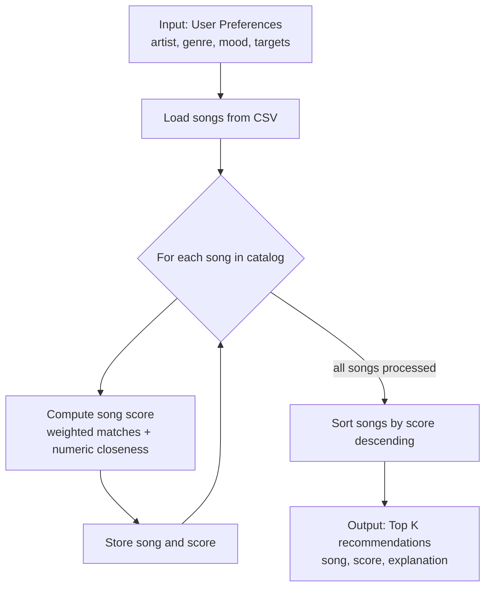

# 🎵 Music Recommender Simulation

## Project Summary

In this project you will build and explain a small music recommender system.

Your goal is to:

- Represent songs and a user "taste profile" as data
- Design a scoring rule that turns that data into recommendations
- Evaluate what your system gets right and wrong
- Reflect on how this mirrors real world AI recommenders

Replace this paragraph with your own summary of what your version does.

---

Each listening session starts from the first song the user plays, and that seed helps set the profile used to score similar songs. The recommender uses the available song fields (`id`, `title`, `artist`, `genre`, `mood`, `energy`, `tempo_bpm`, `valence`, `danceability`, `acousticness`) and applies weighted matching in this priority order: artist (highest), then genre, mood, tempo, energy, valence, danceability, and acousticness.

## How The System Works

Explain your design in plain language.

Some prompts to answer:

- What features does each `Song` use in your system
  - For example: genre, mood, energy, tempo
- What information does your `UserProfile` store
- How does your `Recommender` compute a score for each song
- How do you choose which songs to recommend

You can include a simple diagram or bullet list if helpful.

### Data Flow Map



This matches the actual recommender flow: user preferences are read once, each song is scored independently in a loop, then all scored songs are ranked to return top results.

This recommender simulates how real systems combine multiple signals instead of using one rule. Each session starts from the user's first-played song, and that seed helps set a preferred artist signal for similarity. For each song, the model computes a weighted compatibility score from categorical matches and numeric closeness. The scoring priority is: artist, genre, mood, tempo, energy, valence, danceability, then acousticness. After each song is scored, the list is ranked from highest score to lowest and the top `k` songs are returned.

### Algorithm Recipe (Scoring Rule)

For each song, compute:

`score(song, user) = w_artist * I(artist_match) + w_genre * I(genre_match) + w_mood * I(mood_match) + w_tempo * tempo_closeness + w_energy * energy_closeness + w_valence * valence_closeness + w_danceability * danceability_closeness + w_acousticness * acousticness_closeness`

Where:

- `I(artist_match)` is `1` if song artist equals user favorite artist, otherwise `0`
- `I(genre_match)` is `1` if song genre equals user favorite genre, otherwise `0`
- `I(mood_match)` is `1` if song mood equals user favorite mood, otherwise `0`
- each closeness term rewards songs that are numerically closer to the user target value

Suggested starter weights:

- `w_artist = 4.0`
- `w_genre = 3.0`
- `w_mood = 2.0`
- `w_tempo_bpm = 1.8`
- `w_energy = 1.5`
- `w_valence = 1.2`
- `w_danceability = 1.0`
- `w_acousticness = 0.8`

Weight rationale:

- Artist is weighted highest because users often replay multiple songs from artists they already like.
- Genre and mood are still strong context signals.
- Tempo and energy are next so songs match intensity and pace.
- Valence, danceability, and acousticness add finer-grained fit.

### Prompt to Ask Copilot

Use this prompt when implementing your scoring function:

"Help me implement a song scoring function in Python. I need a distance-based score for numeric features so songs closer to the user's target value get more points. For energy in the range 0 to 1, compute a closeness score like `1 - abs(song_energy - target_energy)`. Then combine this with weighted categorical matches for genre and mood. Show a clean formula, explain why closeness is better than simply rewarding high energy, and provide Python code that returns both score and explanation."

If your system starts from a first-played seed song, include a favorite artist preference and assign artist the largest weight in the final score.

### Why We Need Scoring and Ranking

- Scoring rule: evaluates one song at a time and converts feature similarity into a single numeric value.
- Ranking rule: sorts all candidate songs by score and selects the top `k` recommendations.

Both are required because a score by itself does not choose winners from a catalog, and ranking without a consistent score has no reliable basis for ordering songs.

### Simulation Features

`Song` features used:

- `id`
- `title`
- `artist`
- `genre`
- `mood`
- `energy`
- `tempo_bpm`
- `valence`
- `danceability`
- `acousticness`

`UserProfile` features used:

- `favorite_genre`
- `favorite_mood`
- `favorite_artist`
- `target_energy`
- `target_tempo_bpm`
- `target_valence`
- `target_danceability`
- `target_acousticness`
- `likes_acoustic`

---

## Getting Started

### Setup

1. Create a virtual environment (optional but recommended):

   ```bash
   python -m venv .venv
   source .venv/bin/activate      # Mac or Linux
   .venv\Scripts\activate         # Windows

   ```

2. Install dependencies

```bash
pip install -r requirements.txt
```

3. Run the app:

```bash
python -m src.main
```

### Running Tests

Run the starter tests with:

```bash
pytest
```

You can add more tests in `tests/test_recommender.py`.

### CLI Recommendation Screenshot

Terminal output showing recommended song titles, scores, and reasons is saved in:

- `assets/recommendations-output.txt`

Screenshot gallery for each tested profile:

- High-Energy Pop: `assets/stress-high-energy-pop.png`
- Chill Lofi: `assets/stress-chill-lofi.png`
- Deep Intense Rock: `assets/stress-deep-intense-rock.png`
- Adversarial Conflict (Sad but Hyper): `assets/stress-adversarial-sad-hyper.png`
- Adversarial Mismatch (Acoustic Club): `assets/stress-adversarial-acoustic-club.png`

Once these screenshot files are saved in `assets/`, include them with:

```markdown


```

---

## Experiments You Tried

### Step 1: Stress Test with Diverse Profiles

I tested five profiles in `src/main.py`:

- High-Energy Pop
- Chill Lofi
- Deep Intense Rock
- Adversarial Conflict: Sad but Hyper
- Adversarial Mismatch: Acoustic Club

The first three are distinct listener types. The last two are edge-case profiles designed to test conflicting or unusual preferences.

#### System Evaluation Prompt (Adversarial Profiles)

I used this prompt pattern for Copilot system evaluation:

> Using #codebase context, suggest adversarial user preference dictionaries for this music recommender. I want profiles that intentionally conflict (for example high energy + sad mood, or high danceability + very high acousticness) so I can test if the weighted scoring produces surprising or brittle rankings.

### Step 2: Accuracy and Surprises

Intuition check for `Deep Intense Rock`:

- Top result was `Storm Runner`, which feels correct because it matches both `genre=rock` and `mood=intense` and is close on energy and tempo.
- A surprise was `Gym Hero` ranking above some rock songs, which suggests strong energy/tempo overlap can beat genre mismatches after reweighting.

Prompt used in Inline Chat to explain a top-ranked song:

> Explain why `Storm Runner` ranked #1 for the `Deep Intense Rock` profile using the exact weights in `src/recommender.py`. Break down the score by feature contributions (genre, mood, energy, tempo, valence, danceability, acousticness).

### Step 3: Small Data Experiment (Weight Shift)

I ran a sensitivity experiment by changing weights in `src/recommender.py`:

- `energy`: doubled from `1.5` to `3.0`
- `genre`: halved from `3.0` to `1.5`

For the `Deep Intense Rock` profile, ranking comparison:

- Before: `Storm Runner`, `Gym Hero`, `Iron Anthem`, `Night Drive Loop`, `Neon Pulse`
- After: `Storm Runner`, `Gym Hero`, `Iron Anthem`, `Neon Pulse`, `Night Drive Loop`

Interpretation:

- The experiment made rankings more sensitive to energy alignment and slightly less anchored on genre.
- Results became somewhat more intensity-driven (not strictly more accurate), which is useful when testing recommender sensitivity.

---

## Limitations and Risks

Summarize some limitations of your recommender.

Examples:

- It only works on a tiny catalog
- It does not understand lyrics or language
- It might over favor one genre or mood

You will go deeper on this in your model card.

---

## Reflection

Read and complete `model_card.md`:

[**Model Card**](model_card.md)

Write 1 to 2 paragraphs here about what you learned:

- about how recommenders turn data into predictions
- about where bias or unfairness could show up in systems like this

---

## 7. `model_card_template.md`

Combines reflection and model card framing from the Module 3 guidance. :contentReference[oaicite:2]{index=2}

```markdown
# 🎧 Model Card - Music Recommender Simulation

## 1. Model Name

Give your recommender a name, for example:

> VibeFinder 1.0

---

## 2. Intended Use

- What is this system trying to do
- Who is it for

Example:

> This model suggests 3 to 5 songs from a small catalog based on a user's preferred genre, mood, and energy level. It is for classroom exploration only, not for real users.

---

## 3. How It Works (Short Explanation)

Describe your scoring logic in plain language.

- What features of each song does it consider
- What information about the user does it use
- How does it turn those into a number

Try to avoid code in this section, treat it like an explanation to a non programmer.

---

## 4. Data

Describe your dataset.

- How many songs are in `data/songs.csv`
- Did you add or remove any songs
- What kinds of genres or moods are represented
- Whose taste does this data mostly reflect

---

## 5. Strengths

Where does your recommender work well

You can think about:

- Situations where the top results "felt right"
- Particular user profiles it served well
- Simplicity or transparency benefits

---

## 6. Limitations and Bias

Where does your recommender struggle

Some prompts:

- Does it ignore some genres or moods
- Does it treat all users as if they have the same taste shape
- Is it biased toward high energy or one genre by default
- How could this be unfair if used in a real product

---

## 7. Evaluation

How did you check your system

Examples:

- You tried multiple user profiles and wrote down whether the results matched your expectations
- You compared your simulation to what a real app like Spotify or YouTube tends to recommend
- You wrote tests for your scoring logic

You do not need a numeric metric, but if you used one, explain what it measures.

---

## 8. Future Work

If you had more time, how would you improve this recommender

Examples:

- Add support for multiple users and "group vibe" recommendations
- Balance diversity of songs instead of always picking the closest match
- Use more features, like tempo ranges or lyric themes

---

## 9. Personal Reflection

A few sentences about what you learned:

- What surprised you about how your system behaved
- How did building this change how you think about real music recommenders
- Where do you think human judgment still matters, even if the model seems "smart"
```
